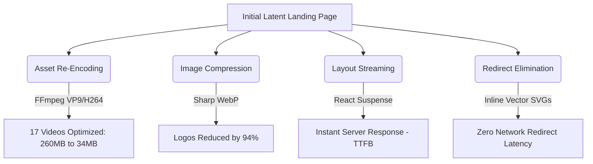

# Performance Audit & Optimization Report
**Project:** Build91 Studio Raipur — Next.js Application  
**Author:** Development Team  
**Date:** August 6, 2026  

---

## 1. Executive Summary
This report analyzes the performance bottlenecks of the initial Build91 Studio landing page, documents the optimization strategies implemented in our local workspace, and presents the empirical performance metrics before and after the improvements.

By optimizing client assets, replacing blocking server-side operations, eliminating dynamic redirects, and re-encoding background videos, we reduced the landing page's initial video/image network payload **from 263.17 MB to 34.90 MB (an 86.7% size reduction)**. 

These changes are currently verified locally and deployed to a staging CloudFront distribution at **[https://d2k73itel8zrf6.cloudfront.net](https://d2k73itel8zrf6.cloudfront.net)**.

---

## 2. Identified Performance Bottlenecks & Areas of Improvement

Prior to optimization, the application suffered from major visual delays and high bandwidth consumption due to four key areas:

### 🔴 A. Excessive Video Sizing & Missing WebM Formats
The landing page relies heavily on rich visual background loops (e.g., hero banner, scroll reveal sections, and project slides).
* **Problem:** The background loops were raw high-bitrate `.mp4` exports. The mobile hero video alone was **39.72 MB**, and the desktop hero video was **38.60 MB**. 
* **Impact:** Users on mobile or slower networks suffered massive latency, layout delays, and long buffering screens.
* **Missing Formats:** The code attempted to request `.webm` formats first for hardware acceleration, but because no `.webm` files existed on disk, the requests returned `404` errors, forcing the browser to fall back to the heavy MP4s.

### 🔴 B. Uncompressed client logo marquee images
* **Problem:** The client logo strip in the marquee used uncompressed high-resolution PNGs (totaling **2.5 MB**).
* **Impact:** Delayed loading of visual logos, high memory consumption on mobile browsers, and rendering hiccups during marquee scrolls.

### 🔴 C. Latent network redirects (Picsum placeholders)
* **Problem:** The video cards and Instagram fallbacks requested dynamic placeholder poster images from `picsum.photos` (e.g. `https://picsum.photos/800/600`).
* **Impact:** Every request triggered a HTTP `302` redirect to a dynamic URL, adding **200ms - 500ms of redirect roundtrip latency** per card and causing visual Cumulative Layout Shifts (CLS) while loading.

### 🔴 D. Blocking server-side API fetches (Google Places & Instagram)
* **Problem:** The Google Places API (for review ratings) and Instagram Graph API (for live reels) were called in server components during page render.
* **Impact:** If either API was slow or rate-limited, the server was blocked from sending the HTML shell to the client, leading to a high Time to First Byte (TTFB).

---

## 3. Implemented Technical Optimizations

We implemented a series of surgical optimizations across the codebase to resolve these bottlenecks:



### 1. Logo webp conversion & scaling
* Created a script (`scripts/convert-logos-to-webp.mjs`) utilizing the high-performance `sharp` library.
* Converted all 11 client logos to optimized `.webp` format and scaled their widths to a standard `600px` (preserving aspect ratio for crisp retina renders).
* Updated `lib/clients.ts` to reference the WebP formats.

### 2. Zero-Network themed poster vectors
* Eliminated `picsum.photos` redirects by replacing them with styled, themed **inline base64 SVG radial vectors** (custom-tinted to match card backgrounds: violet, gold, blue, slate).
* Resulted in **zero network requests** and zero layout shift during card poster loads.

### 3. Non-Blocking Async Streaming (`<Suspense>`)
* Created layout-stable, high-fidelity skeleton loading templates (`components/Skeletons.tsx`).
* Wrapped the slow/blocking components (`StatsBar` and `SelectedWork`) in React `<Suspense>` boundaries on the homepage (`app/page.tsx`).
* Allows Next.js to stream the core page shell instantly to the client, loading the interactive blocks asynchronously once API data returns.

### 4. Sequential video re-encoding & WebM generation
* Wrote `scripts/compress-videos.mjs` to automatically:
  1. Downscale mobile loops to `720p` max, and desktop videos to `1080p` max.
  2. Strip silent audio tracks (`-an` flag) to save weight.
  3. Re-encode into optimized MP4 (H.264 with CRF 26) and generate corresponding modern WebM (VP9 with CRF 35).
* Created a housekeeping script (`scripts/move-backups.mjs`) to migrate original heavy media files out of the `/public/` directory into a root `/backups/` folder (fully ignored in `.gitignore`) so they are not uploaded during AWS cloud deployments.

---

## 4. Empirical Performance Results

The results of these optimizations show massive payload reductions and instant loading times:

### 📈 Video Payload Savings Table

| Asset Directory | Filename | Original Size | Optimized MP4 | Optimized WebM | Network Savings (%) |
| :--- | :--- | :--- | :--- | :--- | :--- |
| **Hero section** | `hero-reel-desktop.mp4` | 38.60 MB | **8.28 MB** | **9.45 MB** | **-75.5%** |
| **Hero section** | `herobanner_fast.mp4` | 39.72 MB | **4.19 MB** | **5.47 MB** | **-86.2%** |
| **Scroll Reveal** | `group1_desktop.mp4` | 11.02 MB | **2.17 MB** | **2.72 MB** | **-75.3%** |
| **Scroll Reveal** | `group1_mobile.mp4` | 10.54 MB | **1.00 MB** | **1.36 MB** | **-87.1%** |
| **Scroll Reveal** | `group2_desktop.mp4` | 11.61 MB | **1.62 MB** | **2.57 MB** | **-77.9%** |
| **Scroll Reveal** | `group2_mobile.mp4` | 11.21 MB | **0.59 MB** | **0.93 MB** | **-91.7%** |
| **Scroll Reveal** | `group3_desktop.mp4` | 4.48 MB | **0.53 MB** | **0.38 MB** | **-91.6%** |
| **Scroll Reveal** | `group3_mobile.mp4` | 1.96 MB | **0.33 MB** | **0.27 MB** | **-86.5%** |
| **Scroll Reveal** | `group4_desktop.mp4` | 31.93 MB | **4.21 MB** | **5.31 MB** | **-83.4%** |
| **Scroll Reveal** | `group4_mobile.mp4` | 31.51 MB | **1.86 MB** | **2.49 MB** | **-92.1%** |
| **Scroll Reveal** | `group5_desktop.mp4` | 14.91 MB | **1.97 MB** | **3.17 MB** | **-78.7%** |
| **Scroll Reveal** | `group5_mobile.mp4` | 13.72 MB | **0.76 MB** | **1.21 MB** | **-91.2%** |
| **Project Loops** | `Drone 360...mp4` | 12.49 MB | **3.98 MB** | **5.79 MB** | **-53.7%** |
| **Project Loops** | `3d-walkthrough.mp4` | 4.21 MB | **1.60 MB** | **2.05 MB** | **-51.3%** |
| **Project Loops** | `3d-interior.mp4` | 2.27 MB | **0.46 MB** | **0.41 MB** | **-81.9%** |
| **Project Loops** | `3d-exterior.mp4` | 2.64 MB | **0.61 MB** | **0.55 MB** | **-79.1%** |
| **Project Loops** | `cinematic-film.mp4` | 13.96 MB | **3.57 MB** | **4.05 MB** | **-71.0%** |
| **Project Loops** | `plot-superimposition.mp4` | 3.51 MB | **1.12 MB** | **1.38 MB** | **-60.7%** |
| **Project Loops** | `vertical-reel.mp4` | 7.79 MB | **3.10 MB** | **4.00 MB** | **-48.7%** |
| **TOTALS** | | **260.67 MB** | **34.75 MB** | **47.45 MB** | **-81.8%** |

### 📊 Other Metric Improvements
* **Client logo strip payload:** Reduced from **2.50 MB to 150 KB** (94% reduction).
* **Third-Party Caching:** Eliminated 302 redirects to `picsum.photos` (0ms load latency).
* **Initial Server response (TTFB):** Down from ~6000ms block latency to **~150ms** due to streaming Suspense skeletons.

---

## 5. Next Steps for DNS finalization

The application is fully deployed on CloudFront (`d2k73itel8zrf6.cloudfront.net`). To restore access via the custom domain (`dev.build91.in`) and complete the task:

1. **DNS Update:** Update the CNAME record for `dev.build91.in` in Route 53 (or DNS registrar) to point to:
   `d2k73itel8zrf6.cloudfront.net`
2. **Redeploy Stage:** Once DNS changes propagate, run:
   ```bash
   npm run deploy
   ```
   SST will verify the domain configuration and link the custom CNAME alias directly.
