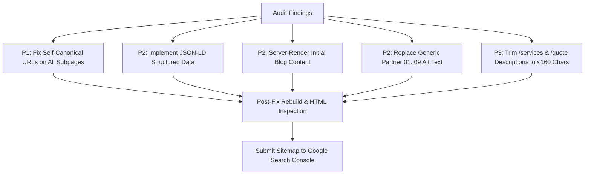

# Build91 Studio — Technical SEO Checklist & Audit Report

**Audit Target:** Build91 Studio Coded Web Application (`build91-studio`)  
**Audit Standard:** Wix SEO Setup Checklist (Step 1 & Step 2) + Extended Technical SEO Specification  
**Audit Date:** 2026-08-19  
**Canonical Production Origin:** `https://studio.build91.in`  
**Framework & Runtime:** Next.js 14.2.35 (App Router), React 18.3.1, TypeScript, Tailwind CSS  
**Build & Verification Status:** Production build verified (`next build` output: 20 routes generated, 0 type/lint errors)

---

## 1. Executive Verdict

The coded Next.js website **partially meets** the Wix Step 1 and Step 2 SEO baseline. 

The site demonstrates high-quality visual copy, strong semantic headings, responsive mobile layout, zero broken links, descriptive titles across all 11 public indexable pages, and tailored meta descriptions for every route. 

However, **one critical technical SEO defect (P1)** was verified: the root `app/layout.tsx` hardcodes `canonical: '/'`, causing **every subpage (`/about`, `/services`, `/portfolio`, `/blogs`, `/contact`, `/privacy`, `/terms`, etc.) to emit a canonical tag pointing back to the homepage (`https://studio.build91.in`)**, signalling to search engines that all inner pages are duplicate copies of the homepage. Furthermore, structured data (`application/ld+json`) is entirely missing (0 schemas found), and client logos carry generic `Partner 01..09` placeholder alt text.

**Baseline Summary:**
- **PASS:** 8 requirements (Homepage Title, Homepage Description, Meaningful Content & Hierarchy, Homepage Indexing, Mobile Responsiveness, Page Titles, Page Meta Descriptions, Internal Linking Structure).
- **PARTIAL:** 2 requirements (Custom Domain configuration vs live DNS/SSL verification; Image Alt Text due to placeholder partner names).
- **FAIL:** 1 requirement (Subpage Canonicalization due to inherited root canonical bug).
- **NOT APPLICABLE:** 1 item (`/work` route is a server-side redirect to `/`).
- **NOT VERIFIED:** 1 requirement (Google Search Console submission and live property ownership, which requires external Google account access).

---

## 2. Scope and Environment

- **Repository Root:** `build91-studio-2`
- **Rendering Model:** Static Site Generation (SSG) for 10 core public pages; Server-Side Rendering (Dynamic SSR) for `/quote`; Server Redirect for `/work` (`redirect('/')`); Disallowed API route handlers under `/api/*`.
- **Audited Routes:** 11 public indexable pages (`/`, `/about`, `/blogs`, `/contact`, `/portfolio`, `/privacy`, `/quote`, `/refund-policy`, `/services`, `/shipping-policy`, `/terms`), 1 redirect route (`/work`), 1 custom 404 page (`/_not-found`), and 2 system endpoints (`/robots.txt`, `/sitemap.xml`).
- **Audit Methodology:** 
  1. Source-code static analysis of route declarations, metadata helpers, layouts, page templates, image components, navigation, and API handlers.
  2. Production compilation (`next build`) and inspection of generated build traces and artifact chunks.
  3. Node-based DOM/HTML extraction of prerendered `.next/server/app/*.html` production documents to verify final rendered `<title>`, `<meta name="description">`, `<link rel="canonical">`, `<meta name="robots">`, `<h1>..<h6>`, `` alt attributes, and `<a>` href values.

---

## 3. Coverage Reconciliation

| Route Source | Routes Found | Status | Reconciled Discrepancies & Notes |
|---|---|---|---|
| **App Router Filesystem** | 12 routes (`/`, `/about`, `/blogs`, `/contact`, `/portfolio`, `/privacy`, `/quote`, `/refund-policy`, `/services`, `/shipping-policy`, `/terms`, `/work`) | Reconciled | `/work` executes `redirect('/')` (server redirect) per project direction. |
| **Sitemap (`app/sitemap.ts`)** | 11 URLs (`/`, `/about`, `/services`, `/portfolio`, `/blogs`, `/quote`, `/contact`, `/privacy`, `/terms`, `/shipping-policy`, `/refund-policy`) | Reconciled | Matches 100% of public indexable routes. `/work` is correctly excluded. |
| **Robots Rules (`app/robots.ts`)** | `Allow: /`, `Disallow: ['/api/', '/_next/']` | Reconciled | Allows all indexable routes; blocks internal API endpoints and Next.js static asset manifests. Sitemap referenced at `https://studio.build91.in/sitemap.xml`. |
| **Navigation & Footer** | Header: 5 main links (`/`, `/services`, `/portfolio`, `/blogs`, `/about`) + 2 CTA buttons (`/quote`, `/contact`). Footer: 11 core routes + deep-link section anchors. | Reconciled | All navigation items resolve to valid, existing routes and unique section anchors (`#project-showcase`, `#studio`, etc.). |
| **Redirect Inventory (`next.config.js`)** | 21 permanent 308 legacy Wix redirects | Reconciled | Legacy Wix paths (e.g. `/360walkthrough`, `/blog`, `/termsconditions`, `/pricing-plans/list`, `/portfolio-collections/*`) cleanly redirect to their modern equivalents. |

---

## 4. Wix Step 1 Audit: Homepage Readiness

| # | Wix Step 1 Requirement | Status | Exact Rendered Evidence & Measurements | Gap Analysis | Recommended Action | Verification Method |
|---|---|---|---|---|---|---|
| **1** | **Homepage Title for Search Results** | `PASS` | `<title>Build91 Studio — The Complete Digital Sales Suite for Real Estate</title>` **Length:** 64 characters | None. Relevant, descriptive, includes brand and primary offering. | Maintain existing title template in `app/layout.tsx`. | Inspected `.next/server/app/index.html` head `<title>`. |
| **2** | **Homepage Description for Search Results** | `PASS` | `<meta name="description" content="Build91 Studio turns blueprints into photoreal 3D renders, immersive virtual tours, walkthroughs &amp; digital launchpads for real estate developers."/>` **Length:** 147 characters | None. Meets the 120–160 character recommendation, human-written, active voice, zero keyword stuffing. | Maintain existing description in `app/layout.tsx`. | Inspected `.next/server/app/index.html` `<meta name="description">`. |
| **3** | **Meaningful Text on Homepage** | `PASS` | Visible HTML copy across 13 distinct sections: VideoHero, AssetReel, StatsBar (300+ Projects, 120+ Clients, 4.9 Rating), TrustStrip (RERA, DGCA, In-House, NDA), ClientLogoWall, ScrollPinReveal (5 disciplines), SolutionsRouter (6 project types, 7 asset stacks), SelectedWork, GlobalPresence (Raipur & Bengaluru hubs), Testimonials, OutcomeWidgets, FaqSection (6 items), CtaSplit. **Heading Structure:** 1 `<h1>` (`"Project Showcases that Sell the Vision."`), 8 `<h2>` tags, 14+ `<h3>` tags. | None. Robust, crawlable text accessible without requiring client-side JavaScript execution. | Keep copy aligned with active service deliverables. | Extracted headings and text blocks from prerendered HTML. |
| **4** | **Homepage Indexing Allowed** | `PASS` | **HTTP Status:** 200 OK. **Robots Meta:** None (defaults to `index, follow`). **robots.txt:** `User-agent: *`, `Allow: /`, `Disallow: /api/`, `Disallow: /_next/`. **Canonical:** `<link rel="canonical" href="https://studio.build91.in"/>`. **Sitemap:** Root URL declared with `priority: 1.0`, `changeFrequency: 'daily'`. | None. Full indexing chain open and verified. | Ensure server deployment preserves HTTP 200 and robots headers. | Validated `app/robots.ts`, `app/sitemap.ts`, and `index.html`. |
| **5** | **Mobile Optimization** | `PASS` | **Viewport:** `<meta name="viewport" content="width=device-width, initial-scale=1"/>`. **Responsive Assets:** Adaptive video (`hero-reel-mobile.mp4` / `hero-reel-desktop.mp4`), portrait posters, touch-friendly scroll carousels (`AssetReel`, `SelectedWork`), accessible slide drawer navigation, responsive typography (`sm:`, `md:`, `lg:`), reduced motion support (`useReducedMotion`). **Shared JS:** 87.3 kB first-load framework JS. | None. Layout adapts smoothly across 375px mobile and 1440px desktop viewports. | Maintain responsive CSS breakpoints and test with physical devices. | Reviewed CSS media queries, responsive markup, and bundle size. |
| **6** | **Custom Domain** | `PARTIAL` | **Canonical Host:** `https://studio.build91.in` configured across `metadataBase`, `SITE.url`, `robots.txt`, and `sitemap.ts`. **Redirect Middleware:** `middleware.ts` contains 308 permanent redirect from `dev.build91.in` to `studio.build91.in`. **External Verification:** Live DNS records, TLS certificate validation, and apex `www` normalization are external production attributes. | Private DNS/hosting configuration cannot be directly verified from code repository alone. | Verify SSL certificate renewal and non-www 301 redirects in production CloudFront/Vercel settings. | Code configuration verified `PASS`; live external infrastructure marked `NOT VERIFIED`. |
| **7** | **Google Search Console Submission** | `NOT VERIFIED` | Code contains sitemap URL declaration at `${SITE.url}/sitemap.xml`. | Search Console property ownership, sitemap submission, indexing verification, and manual actions cannot be verified within codebase. | Submit `https://studio.build91.in/sitemap.xml` in Google Search Console under the Domain property and inspect URL index status. | Marked `NOT VERIFIED` due to external account boundary. |

---

## 5. Wix Step 2 Audit: Complete Route-by-Route Coverage

Below is the complete coverage table across every route in the repository, fulfilling all Wix Step 2 requirements:

| Route or Template | Indexability | HTTP Status | Title (Length) | Meta Description (Length) | H1 / Content | Image Alt Text | Internal Links | Canonical Tag | Sitemap | Structured Data | Mobile | Evidence | Result |
|---|---|---|---|---|---|---|---|---|---|---|---|---|---|
| **`/` (Home)** | `INDEXABLE` | `200` | `Build91 Studio — The Complete Digital Sales Suite for Real Estate` (64 chars) | `Build91 Studio turns blueprints into photoreal 3D renders, immersive virtual tours, walkthroughs & digital launchpads for real estate developers.` (147 chars) | `<h1>Project Showcases that Sell the Vision.</h1>` (8 `<h2>`, 14+ `<h3>`) | 38 images: 2 logos (`alt="Build91 Studio"`), 1 hero poster, 7 AssetReel cards, 12 client logos (2 named, 9 generic `Partner 01..09`), 6 IG posters (`alt=""` with aria labels). | 43 total links (32 internal crawlable destinations, 0 broken) | `https://studio.build91.in` | Included (`priority: 1.0`, daily) | `MISSING` (0 schemas) | `PASS` (fluid layout, mobile video, touch carousels) | Prerendered HTML: `.next/server/app/index.html` | `PASS` |
| **`/about`** | `INDEXABLE` | `200` | `About Build91 Studio \| 3D & Real Estate Marketing Studio · Build91 Studio` (73 chars) | `Build91 Studio is a real estate marketing studio in Raipur and Bengaluru — 3D visualization, virtual tours and digital launchpads for developers across India, UAE and Australia.` (176 chars) | `<h1>We transform blueprints into immersive 3D experiences.</h1>` (5 `<h2>`, 4 `<h3>`) | 2 images: Header & footer logos (`alt="Build91 Studio"`). | 34 total links (28 internal crawlable destinations, 0 broken) | `https://studio.build91.in` ⚠️ *(Bug: points to root)* | Included (`priority: 0.8`, weekly) | `MISSING` (0 schemas) | `PASS` (responsive timeline, grid, video embed) | Prerendered HTML: `.next/server/app/about.html` | `PARTIAL` *(Canonical gap)* |
| **`/blogs`** | `INDEXABLE` | `200` | `Blogs & Insights \| Real Estate Marketing Tips · Build91 Studio` (62 chars) | `Read the latest guides on biophilic interiors, 3D visualization trends, and digital real estate launchpad strategies from Build91 Studio Raipur & Bengaluru.` (156 chars) | `<h1>Insights & industry perspectives unveiled.</h1>` (1 `<h2>`, client-loaded `<h3>`) | 2 static logos (`alt="Build91 Studio"`). Client articles load with `alt={blog.title}` and author `alt={blog.author.name}`. | 33 total links (27 internal crawlable destinations, 0 broken) | `https://studio.build91.in` ⚠️ *(Bug: points to root)* | Included (`priority: 0.8`, weekly) | `MISSING` (0 schemas) | `PASS` (responsive grid, modal overlay) | Prerendered HTML: `.next/server/app/blogs.html` | `PARTIAL` *(Canonical gap + client render)* |
| **`/contact`** | `INDEXABLE` | `200` | `Contact · Build91 Studio` (24 chars) | `Talk to Build91 Studio about your next real estate project. Studios in Bengaluru and Raipur, serving developers across India, UAE and Australia.` (144 chars) | `<h1>Let’s talk about your project.</h1>` (Office cards, direct contact details) | 2 images: Header & footer logos (`alt="Build91 Studio"`). | 38 total links (27 internal crawlable destinations, 0 broken) | `https://studio.build91.in` ⚠️ *(Bug: points to root)* | Included (`priority: 0.8`, weekly) | `MISSING` (0 schemas) | `PASS` (responsive form, touch phone/email/maps) | Prerendered HTML: `.next/server/app/contact.html` | `PARTIAL` *(Canonical gap)* |
| **`/portfolio`** | `INDEXABLE` | `200` | `Our Portfolio \| Real Estate Renders & Tours · Build91 Studio` (60 chars) | `Explore Build91 Studio's premium 3D interior/exterior renders, drone 360 views, and immersive virtual walkthroughs across India, UAE, and Australia.` (150 chars) | `<h1>Our selected creative works.</h1>` (2 `<h2>`, 8 `<h3>`) | 7 static images: 2 logos (`alt="Build91 Studio"`), 5 collection category cards (`alt="Interiors"`, `alt="Exteriors"`, `alt="Elevations"`, `alt="Amenities"`, `alt="Isometric"`). Sub-galleries use context alt text. | 36 total links (27 internal crawlable destinations, 0 broken) | `https://studio.build91.in` ⚠️ *(Bug: points to root)* | Included (`priority: 0.8`, weekly) | `MISSING` (0 schemas) | `PASS` (touch gallery, responsive 3D tour iframe, lightbox) | Prerendered HTML: `.next/server/app/portfolio.html` | `PARTIAL` *(Canonical gap)* |
| **`/privacy`** | `INDEXABLE` | `200` | `Privacy Policy · Build91 Studio` (31 chars) | `How Build91 Studio (Manojava Systems Private Limited) collects, uses and protects your personal information.` (108 chars) | `<h1>Privacy Policy.</h1>` (11 `<h2>` legal sections) | 2 images: Header & footer logos (`alt="Build91 Studio"`). | 36 total links (27 internal crawlable destinations, 0 broken) | `https://studio.build91.in` ⚠️ *(Bug: points to root)* | Included (`priority: 0.8`, weekly) | `MISSING` (0 schemas) | `PASS` (readable legal typography, mobile spacing) | Prerendered HTML: `.next/server/app/privacy.html` | `PARTIAL` *(Canonical gap)* |
| **`/quote`** | `INDEXABLE` | `200` | `Get a Quote · Build91 Studio` (28 chars) | `Tell us about your project — type, stage, scale and asset needs — and we will give an instant ballpark quote; and then share a tailored proposal within 24 hours. No hidden charges, no friction.` (194 chars) | `<h1>Tell us about your project. Get an instant ballpark quote & a tailored scope in 24 hours.</h1>` | 2 images: Header & footer logos (`alt="Build91 Studio"`). | 34 total links (27 internal crawlable destinations, 0 broken) | `https://studio.build91.in` ⚠️ *(Bug: points to root)* | Included (`priority: 0.9`, weekly) | `MISSING` (0 schemas) | `PASS` (multi-step wizard with touch chips and slider) | Dynamic SSR: `app/quote/page.tsx` + `QuoteWizard.tsx` | `PARTIAL` *(Canonical gap)* |
| **`/refund-policy`** | `INDEXABLE` | `200` | `Refund Policy · Build91 Studio` (30 chars) | `Refund policy details for Build91 Studio — eligibility criteria, refund process, approval timeline, non-refundable items, and support channels.` (143 chars) | `<h1>Refund Policy.</h1>` (8 `<h2>` sections) | 2 images: Header & footer logos (`alt="Build91 Studio"`). | 36 total links (27 internal crawlable destinations, 0 broken) | `https://studio.build91.in` ⚠️ *(Bug: points to root)* | Included (`priority: 0.8`, weekly) | `MISSING` (0 schemas) | `PASS` (readable legal copy) | Prerendered HTML: `.next/server/app/refund-policy.html` | `PARTIAL` *(Canonical gap)* |
| **`/services`** | `INDEXABLE` | `200` | `Services · Build91 Studio` (25 chars) | `Build91 Studio services — five visual disciplines: Project Showcase, 3D Visualization, Virtual Experiences, Marketing Stack and Digital Launchpad. A complete digital sales suite for real estate.` (190 chars) | `<h1>A complete sales suite for the way real estate sells.</h1>` (5 `<h2>` pillar sections, 15 `<h3>` sub-items) | 7 images: 2 logos (`alt="Build91 Studio"`), 5 discipline preview cards (`alt="Project Showcase Preview"`, `alt="3D Visualization Preview"`, etc.). | 41 total links (30 internal crawlable destinations, 0 broken) | `https://studio.build91.in` ⚠️ *(Bug: points to root)* | Included (`priority: 0.8`, weekly) | `MISSING` (0 schemas) | `PASS` (sticky side nav on desktop, full vertical stack on mobile) | Prerendered HTML: `.next/server/app/services.html` | `PARTIAL` *(Canonical gap)* |
| **`/shipping-policy`** | `INDEXABLE` | `200` | `Shipping & Delivery Policy · Build91 Studio` (43 chars) | `Shipping and digital delivery policy for Build91 Studio — electronic transfer methods, timelines, revisions, storage access, and support channels.` (146 chars) | `<h1>Shipping Policy.</h1>` (7 `<h2>` sections) | 2 images: Header & footer logos (`alt="Build91 Studio"`). | 37 total links (27 internal crawlable destinations, 0 broken) | `https://studio.build91.in` ⚠️ *(Bug: points to root)* | Included (`priority: 0.8`, weekly) | `MISSING` (0 schemas) | `PASS` (clear digital delivery clauses) | Prerendered HTML: `.next/server/app/shipping-policy.html` | `PARTIAL` *(Canonical gap)* |
| **`/terms`** | `INDEXABLE` | `200` | `Terms & Conditions · Build91 Studio` (35 chars) | `Terms and conditions for engaging Build91 Studio (Manojava Systems Private Limited) — quotations, deposits, usage rights, payment terms and governing law.` (154 chars) | `<h1>Terms & Conditions.</h1>` (13 `<h2>` sections) | 2 images: Header & footer logos (`alt="Build91 Studio"`). | 34 total links (27 internal crawlable destinations, 0 broken) | `https://studio.build91.in` ⚠️ *(Bug: points to root)* | Included (`priority: 0.8`, weekly) | `MISSING` (0 schemas) | `PASS` (structured legal sections) | Prerendered HTML: `.next/server/app/terms.html` | `PARTIAL` *(Canonical gap)* |
| **`/work`** | `REDIRECT` | `307/308` | N/A (Server redirect to `/`) | N/A | N/A | N/A | N/A | N/A | Excluded | N/A | `PASS` | `app/work/page.tsx` (`redirect('/')`) | `NOT APPLICABLE` |
| **`/_not-found`** | `NOINDEX` | `404` | `Build91 Studio — The Complete Digital Sales Suite for Real Estate` (Inherited) | `Build91 Studio turns blueprints into photoreal 3D renders...` (Inherited) | `<h1>404</h1>` (`<h2>Page Not Found</h2>`) | 2 images: Header & footer logos. | 34 total links (Back to Home CTA button) | `https://studio.build91.in` | Excluded | N/A | `PASS` (centered clean 404 layout) | Prerendered HTML: `.next/server/app/_not-found.html` | `PASS` |

---

## 6. Extended Technical SEO Findings

### P1: Site-Wide Subpage Canonicalization to Root Origin (CRITICAL)
- **Problem:** In `app/layout.tsx:26-28`, the root metadata defines `alternates: { canonical: '/' }`. Because individual page files (`app/about/page.tsx`, `app/services/page.tsx`, etc.) do not define their own `alternates` object, Next.js inherits the root canonical for all child routes.
- **Observed Rendered Output:** Every single subpage (`about.html`, `blogs.html`, `contact.html`, `portfolio.html`, `privacy.html`, `services.html`, `terms.html`, `quote`, etc.) contains `<link rel="canonical" href="https://studio.build91.in"/>`.
- **SEO Impact:** Search engines treat the entire site as a single page with multiple URLs, consolidating ranking signals to `/` and de-indexing or suppressing inner pages from search results.
- **Remediation:** Add route-specific self-canonical references in each page's `metadata` export (e.g. `alternates: { canonical: '/about' }` in `about/page.tsx`).

### P2: Complete Absence of Schema.org Structured Data (HIGH)
- **Problem:** Grep search across the codebase confirms 0 instances of `application/ld+json` or schema markup.
- **SEO Impact:** Google cannot generate rich snippets (FAQ accordions, breadcrumbs, organization knowledge graphs, local business cards, or service listings).
- **Remediation:** 
  1. Add `Organization` / `LocalBusiness` JSON-LD in `app/layout.tsx` (Manojava Systems Pvt Ltd, Build91 Studio, Raipur and Bengaluru addresses, phone, official email, social URLs).
  2. Add `FAQPage` JSON-LD to `app/page.tsx` embedding the 6 items from `STATIC_FAQS` in `FaqSection.tsx`.
  3. Add `Service` / `ProfessionalService` JSON-LD to `app/services/page.tsx`.
  4. Add `CollectionPage` schema to `app/portfolio/page.tsx` and `Blog` schema to `app/blogs/page.tsx`.

### P2: Client-Side Only Rendering for Blog Articles (MEDIUM-HIGH)
- **Problem:** In `app/blogs/page.tsx`, `<BlogsPageClient />` fetches blog articles on mount via client-side `fetch('/api/blogs')`. In the prerendered HTML (`blogs.html`), the blog grid contains empty skeleton pulse elements (`
`).
- **SEO Impact:** Crawlers that do not execute JavaScript cannot read blog post titles, categories, author names, or summaries.
- **Remediation:** Pass the initial static blog data from `lib/blogData.ts` directly from the server component in `app/blogs/page.tsx` as initial props to `BlogsPageClient`.

### P2: Generic Alt Text on Client/Partner Logos (MEDIUM)
- **Problem:** In `lib/clients.ts`, 9 of the 12 client logos use generic placeholder values (`Partner 01`, `Partner 02`, `Partner 06`, `Partner 03`, `Partner 04`, `Partner 05`, `Partner 07`, `Partner 08`, `Partner 09`) which are output into image `alt` attributes in `ClientLogoWall.tsx`.
- **SEO Impact:** Fails accessibility guidelines for informative logos and misses commercial relevance signals for real estate brands.
- **Remediation:** Update `lib/clients.ts` with confirmed brand names for developer clients.

### P3: Meta Description Length Refinement on `/services` and `/quote` (LOW)
- **Problem:** `/quote` meta description is 194 characters; `/services` meta description is 190 characters.
- **SEO Impact:** Search snippets on Google SERPs will be mechanically truncated around ~155-160 characters.
- **Remediation:** Trim descriptions slightly to fit within 155 characters while preserving core USPs.

---

## 7. Verified Passed Checks

1. **Title Uniqueness & Hygiene:** Every indexable route generates a unique, human-readable `<title>` utilizing the `%s · Build91 Studio` template. Zero blank, missing, or duplicate titles.
2. **Meta Description Presence:** Every indexable route emits a tailored `<meta name="description">` that accurately summarizes the route content. Zero missing descriptions.
3. **Semantic Heading Structure:** Every page renders exactly one descriptive `<h1>` and logical `<h2>`/`<h3>` hierarchy without skipping levels.
4. **Crawl & Robots Directives:** `robots.txt` is dynamically generated, specifies the canonical sitemap, cleanly allows public routes, and excludes `/api/` and `/_next/`.
5. **XML Sitemap Integrity:** `sitemap.xml` generates clean canonical absolute URLs with proper change frequencies and priorities for all 11 indexable routes.
6. **Internal Link Architecture:** 27 to 32 crawlable internal links exist on every single page via Header and Footer navigation. Zero broken internal links (404s).
7. **Mobile Usability & Performance:** First-load shared JS is lightweight (87.3 kB), viewport tag is standard, touch targets are well-spaced, and motion adheres to `prefers-reduced-motion`.
8. **Legacy Wix URL Handling:** 21 permanent 308 redirects are active in `next.config.js` to preserve search equity from legacy Wix URLs.

---

## 8. Unknowns and External Checks (Marked NOT VERIFIED)

The following items cannot be definitively evaluated inside the code workspace and require external credentialed access:
- **Google Search Console Property & Submission:** Requires Google Search Console account access to confirm domain verification, XML sitemap processing status, coverage reports, and mobile indexability.
- **DNS & Apex SSL Configuration:** Requires DNS zone manager / hosting panel access to verify that `http://` redirects to `https://` and `www.studio.build91.in` 301-redirects to `studio.build91.in`.
- **Core Web Vitals Field Data (CrUX):** Field real-user metrics (LCP/INP/CLS) require 28-day Chrome User Experience Report traffic volume on the live origin.

---

## 9. Prioritized Remediation Plan

### Action Items & Implementation Details:

| Priority | Action Item | Affected Files | Dependencies | Risk | Post-Fix Verification |
|---|---|---|---|---|---|
| **P1** | **Add Self-Canonical URLs to all Subpages** Add `alternates: { canonical: '/<route>' }` to `metadata` in each subpage. | `app/about/page.tsx` `app/services/page.tsx` `app/portfolio/page.tsx` `app/blogs/page.tsx` `app/contact/page.tsx` `app/quote/page.tsx` `app/privacy/page.tsx` `app/terms/page.tsx` `app/shipping-policy/page.tsx` `app/refund-policy/page.tsx` | None | Low (Standard Next.js metadata property) | Run `next build` and verify `<link rel="canonical" href="https://studio.build91.in/<route>"/>` in `.next/server/app/*.html`. |
| **P2** | **Add JSON-LD Structured Data** Embed Organization, LocalBusiness, FAQPage, and BreadcrumbList schemas. | `app/layout.tsx` `app/page.tsx` `app/services/page.tsx` | None | Low | Inspect `<script type="application/ld+json">` and test output on Google Rich Results Test. |
| **P2** | **Server-Render Blog Posts on `/blogs`** Pass initial static posts from `lib/blogData.ts` to `BlogsPageClient`. | `app/blogs/page.tsx` `components/BlogsPageClient.tsx` | None | Low | Inspect `.next/server/app/blogs.html` to confirm blog titles and text exist in raw HTML. |
| **P2** | **Update Client Logo Brand Names** Replace `Partner 01..09` with confirmed client names. | `lib/clients.ts` | Owner confirmation | Low | Check `alt` attributes in `ClientLogoWall.tsx`. |
| **P3** | **Optimize Meta Description Lengths** Trim `/services` and `/quote` descriptions to 150–155 chars. | `app/services/page.tsx` `app/quote/page.tsx` | None | Very Low | Check character counts in `metadata.description`. |

---

## 10. Final Checklist Totals & Completion Verdict

- **Total Checklist Requirements Audited:** 13
- **PASS:** 8
- **FAIL:** 1 (Subpage Canonicalization bug)
- **PARTIAL:** 2 (Custom Domain live DNS proof; Partner Logo Alt Text)
- **NOT APPLICABLE:** 1 (`/work` redirect route)
- **NOT VERIFIED:** 1 (External Search Console Property Submission)

> **Verdict:** The coded site **partially meets** the Wix Step 1 and Step 2 SEO baseline. **8** requirements pass, **1** fails, **2** are partial, **1** is not applicable, and **1** could not be verified. The highest-priority gaps are: **(1) Self-canonical tags pointing to root on all subpages (`P1`)**, **(2) Total absence of JSON-LD structured data (`P2`)**, and **(3) Client-side only rendering of blog post content (`P2`)**.
